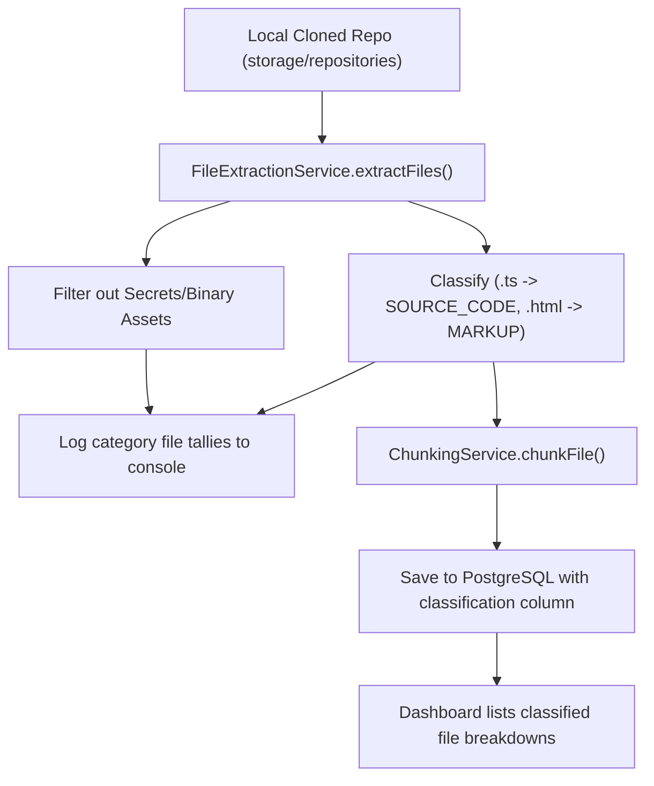

# Walkthrough - Milestone 3.3.6 Repository Indexing Coverage Expansion

The repository file extraction and analysis pipeline has been enhanced to index modern front-end web resources (HTML, CSS, SCSS, Sass, Less), JavaScript ecosystems (.mjs, .cjs), configurations (YAML, TOML, XML, GraphQL), SQL databases, and Markdown documentations comprehensively.

## Files Modified
- **Prisma Schema** ([apps/api/prisma/schema.prisma](file:///Users/gauravgupta/Desktop/CodeAtlas/apps/api/prisma/schema.prisma)):
  - Added optional `classification` text column to the `CodeChunk` model definition.
- **File Extraction Service** ([apps/api/src/services/file-extraction.service.ts](file:///Users/gauravgupta/Desktop/CodeAtlas/apps/api/src/services/file-extraction.service.ts)):
  - Configured wide extension maps matching modern web design and deployment systems.
  - Implemented lightweight `FileClassification` categorization (`SOURCE_CODE`, `MARKUP`, `STYLESHEET`, `CONFIGURATION`, `DOCUMENTATION`).
  - Added strict ignoring patterns for secrets (`.env`, `.env.local` etc.) and binary assets (`.png`, `.jpg`, `.pdf` etc.).
  - Configured structured Winston logs details:
    * `"Extracted: X Source Code Files, Y HTML Files, Z CSS Files, A Configuration Files, B Documentation Files. Total Files Indexed: C"`
- **Repository Analysis Service** ([apps/api/src/services/repository-analysis.service.ts](file:///Users/gauravgupta/Desktop/CodeAtlas/apps/api/src/services/repository-analysis.service.ts)):
  - Synced file extension map and ignored paths logic to ensure accurate file line counting and languages metrics aggregates.
- **Code Chunk Repository** ([apps/api/src/repositories/code-chunk.repository.ts](file:///Users/gauravgupta/Desktop/CodeAtlas/apps/api/src/repositories/code-chunk.repository.ts)):
  - Extended `CreateChunkInput` to save the classification field into PostgreSQL database tables.
- **Repository Processing Service** ([apps/api/src/services/repository-processing.service.ts](file:///Users/gauravgupta/Desktop/CodeAtlas/apps/api/src/services/repository-processing.service.ts)):
  - Modified the create call payload to pass classification values along.
- **Repository Controller** ([apps/api/src/controllers/repository.controller.ts](file:///Users/gauravgupta/Desktop/CodeAtlas/apps/api/src/controllers/repository.controller.ts)):
  - Configured code chunk classification counts grouping inside the repository API queries.
- **Dashboard Types** ([apps/web/src/features/dashboard/types.ts](file:///Users/gauravgupta/Desktop/CodeAtlas/apps/web/src/features/dashboard/types.ts)) & **Dashboard Page** ([apps/web/src/app/(dashboard)/dashboard/page.tsx](file:///Users/gauravgupta/Desktop/CodeAtlas/apps/web/src/app/(dashboard)/dashboard/page.tsx)):
  - Display detailed file classifications breakdown directly within the Repository Indexing info box.

---

## File Classification & Flow

---

## Verification & Testing Instructions

1. **Verify Logging Breakdown Output**:
   - Access the dashboard page at `/dashboard` and trigger a **Sync** operation on a repository.
   - Confirm that the backend log prints:
     * `Extracted: X Source Code Files`
     * `Y HTML Files`
     * `Z CSS Files`
     * `A Configuration Files`
     * `B Documentation Files`
     * `Total Files Indexed: C`
2. **Verify Dashboard Metadata Breakdown**:
   - Verify that the card's `Repository Indexing` block lists the counts for Source Code, Markup, Stylesheets, Configuration, and Documentation.
