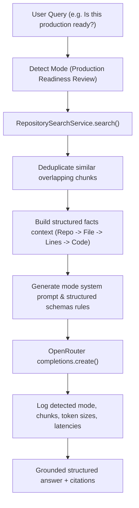

# Walkthrough - Milestone 4.6 AI Code Review & Engineering Reasoning

The AI repository chat backend has been evolved from a basic Q&A agent into a senior AI Software Engineering Assistant with prompt routing, mode detection, context deduplication, and detailed quality evaluation matrices.

## Files Created / Modified
- **Repository Chat Service** ([apps/api/src/services/repository-chat.service.ts](file:///Users/gauravgupta/Desktop/CodeAtlas/apps/api/src/services/repository-chat.service.ts)):
  - Added query mode detection mapping queries to specific execution modes (Explain, Code Review, Security, Performance, production readiness, refactoring, debugging, or general chat).
  - Configured prompt routing combining mode-specific instructions into system prompts.
  - Implemented retrieved code chunks deduplication (on compound key of path and lines) and sorted them by similarity before constructing prompts.
  - Structured prompt templates requiring distinct outputs for `# Repository Overview`, `## Current Implementation`, `## Engineering Analysis` (Strengths/Weaknesses), `## Recommendations` (Observed/Recommendation for security issues), and `## Quality Metrics` scores.
  - Expanded backend Winston logging to capture Detected Mode, Unique Chunks count, Prompt Size in characters, Completion Tokens, Latency, and Execution Time.

---

## prompt Routing & Deduplication Flow

---

## Verification & Testing Instructions

1. **Verify Prompt Routing & Structured Score Outputs**:
   - Query the chat workspace with the question: `"Review this project"`.
   - Confirm that the response includes sections for Repository Overview, Current Implementation, Engineering Analysis, Recommendations, and a detailed Quality Metrics score card.
2. **Verify Telemetry Logs**:
   - Observe backend Winston console logs on query execution.
   - Verify it prints:
     * `Detected Mode: Code Review`
     * `Retrieved Chunks: X total, Y unique chunks remaining`
     * `Prompt Size: Z characters`
     * `LLM completed in A ms. Prompt tokens: B, Completion tokens: C`
     * `Total execution completed in D ms`
