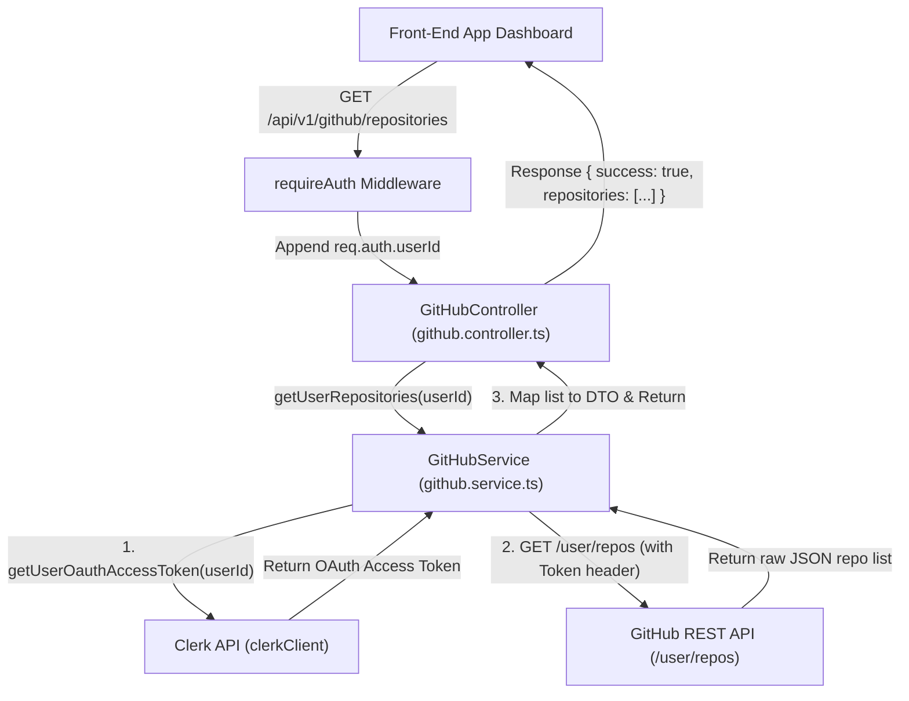

# Walkthrough - Milestone 3.3.1 GitHub Repository Backend Fetching

A backend module has been deployed to communicate with the GitHub REST API and fetch repositories for authenticated Clerk users using their stored GitHub OAuth access tokens.

## Files Created
- **GitHub Integration Service Directory** ([apps/api/src/services/github/](file:///Users/gauravgupta/Desktop/CodeAtlas/apps/api/src/services/github/)):
  - [github.types.ts](file:///Users/gauravgupta/Desktop/CodeAtlas/apps/api/src/services/github/github.types.ts): Declares `GitHubRepositoryDto` containing strictly typed properties (`githubRepoId`, `name`, `fullName`, `cloneUrl`, `stars`, `forks`, `watchers`, etc.).
  - [github.mapper.ts](file:///Users/gauravgupta/Desktop/CodeAtlas/apps/api/src/services/github/github.mapper.ts): Maps raw JSON items returned from GitHub REST endpoints into the DTO format.
  - [github.service.ts](file:///Users/gauravgupta/Desktop/CodeAtlas/apps/api/src/services/github/github.service.ts):
    * Retrieves user GitHub OAuth tokens from Clerk using `clerkClient.users.getUserOauthAccessToken()`.
    * Triggers request to `https://api.github.com/user/repos` sorted by update activity.
    * Parses errors, controls limit rate limits, and throws typed `AppError` values.

## Files Modified
- **GitHub Controller** ([apps/api/src/controllers/github.controller.ts](file:///Users/gauravgupta/Desktop/CodeAtlas/apps/api/src/controllers/github.controller.ts)):
  - Updated constructor to inject the new `GitHubService`.
  - Extract the logged-in Clerk `userId` from `req.auth` and returns a list of mapped repositories.
- **GitHub Routes** ([apps/api/src/routes/github.routes.ts](file:///Users/gauravgupta/Desktop/CodeAtlas/apps/api/src/routes/github.routes.ts)):
  - Link standard paths to import the new `GitHubService` inside the constructor.

## Files Deleted
- **Legacy Service file**: [apps/api/src/services/github.service.ts](file:///Users/gauravgupta/Desktop/CodeAtlas/apps/api/src/services/github.service.ts)

---

## Authentication & API Fetch Flow



---

## Verification & Testing Instructions

1. **Start the API backend**:
   ```bash
   npm run dev
   ```

2. **Trigger local endpoint checks**:
   - Acquire a valid Clerk session token or access the route via your browser dashboard.
   - Dispatch `GET http://localhost:4000/api/v1/github/repositories`.
   - Confirm that the server securely contacts Clerk, resolves the token, fetches repository metadata, and returns standard success JSON responses.
