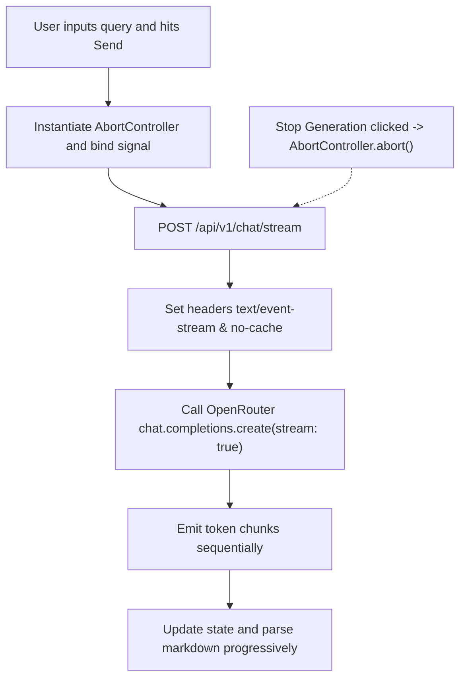

# Walkthrough - Milestone 4.7 Real-Time Streaming AI Responses

The CodeAtlas platform now supports token-by-token real-time streaming chat responses using Server-Sent Events (SSE) and client readable streams.

## Files Created / Modified
- **Repository Chat Service** ([apps/api/src/services/repository-chat.service.ts](file:///Users/gauravgupta/Desktop/CodeAtlas/apps/api/src/services/repository-chat.service.ts)):
  - Added `chatStream` integrating the OpenRouter completions API with `stream: true`.
  - Added check handles matching `signal.aborted` to abort generation instantly if connections are cancelled.
  - Setup logging details capturing Stream Started, First Token Latency, Completion Time, Tokens count, and Client Cancellation events.
- **Chat Controller** ([apps/api/src/controllers/chat.controller.ts](file:///Users/gauravgupta/Desktop/CodeAtlas/apps/api/src/controllers/chat.controller.ts)):
  - Declared `chatStream` mapping parameters, writing SSE chunk headers (`text/event-stream`), and proxying request cancellation `req.on("close")` connections.
- **Chat Router** ([apps/api/src/routes/chat.routes.ts](file:///Users/gauravgupta/Desktop/CodeAtlas/apps/api/src/routes/chat.routes.ts)):
  - Mounted `/stream` POST route configuration.
- **API Client Utility** ([apps/web/src/lib/api-client.ts](file:///Users/gauravgupta/Desktop/CodeAtlas/apps/web/src/lib/api-client.ts)):
  - Exposed a `public async stream(...)` helper wrapping readable streams fetch requests with authentication token configurations and signal cancellation inputs.
- **Chat Workspace Page** ([apps/web/src/app/(dashboard)/dashboard/repository/[id]/chat/page.tsx](file:///Users/gauravgupta/Desktop/CodeAtlas/apps/web/src/app/(dashboard)/dashboard/repository/[id]/chat/page.tsx)):
  - Integrated `api.stream(...)` to consume the token stream reader sequentially.
  - Enabled typing inside input fields while generation is running.
  - Bound `AbortController` to stop generation instantly, replacing the send button with a square Stop button when submitting is active.
  - Programmed a blinking indicator animation representing the typing cursor at the end of the streaming response.

---

## Real-Time SSE Token Streaming Flow

---

## Verification & Testing Instructions

1. **Verify Token Streaming**:
   - Access `/dashboard/repository/REPO_ID/chat`.
   - Input a question and observe that instead of waiting for the full answer, tokens render character-by-character as they are generated.
2. **Verify Stop Generation / Cancellation**:
   - Ask a question requiring a long response (e.g. `Provide a detailed refactoring recommendation`).
   - While the text is actively streaming, click the square "Stop" button in the chat input.
   - Verify that the generation stops instantly and prints a "Generation cancelled" toast notification.
3. **Verify Typing While Generating**:
   - Verify that the text input remains fully editable and you can draft your next question while the assistant streams.
