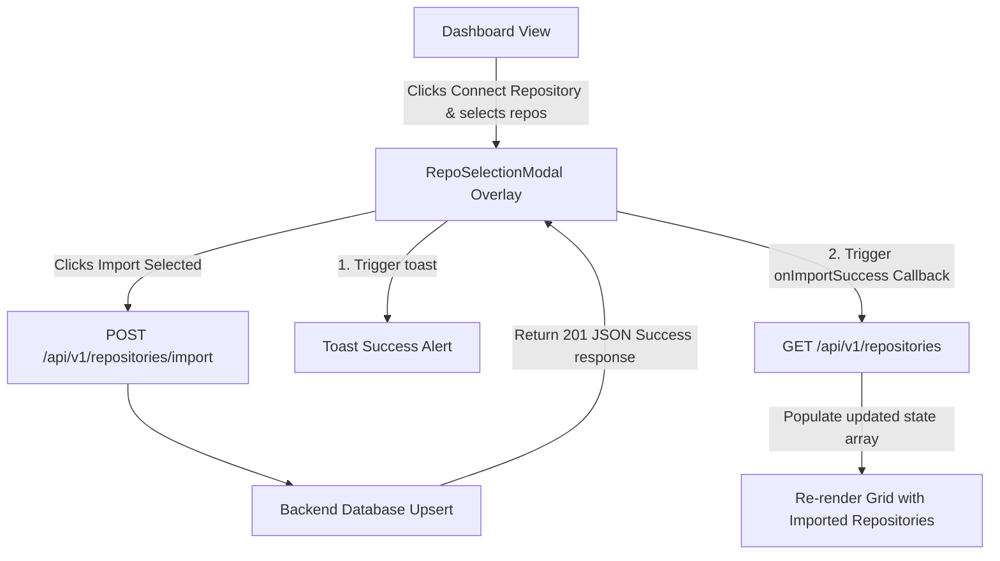

# Walkthrough - Milestone 3.3.3 GitHub Repository Import Integration

Repository import operations have been fully connected between the `RepoSelectionModal` frontend picker and the backend API endpoint (`POST /api/v1/repositories/import`).

## Files Modified
- **Dashboard Types** ([apps/web/src/features/dashboard/types.ts](file:///Users/gauravgupta/Desktop/CodeAtlas/apps/web/src/features/dashboard/types.ts)):
  - Added optional `primaryLanguage`, `stars`, and `forks` properties to the `Repository` interface.
- **Selection Modal Component** ([apps/web/src/features/dashboard/components/RepoSelectionModal.tsx](file:///Users/gauravgupta/Desktop/CodeAtlas/apps/web/src/features/dashboard/components/RepoSelectionModal.tsx)):
  - Modified `handleImport` to trigger `POST /v1/repositories/import` sending payloads mapped matching `ImportRepositoryPayload`.
  - Disables action controls and displays loading spinners while imports run.
  - Implemented custom `onImportSuccess` callback triggers.
  - Triggers success toast popups or duplicate alerts ("Successfully imported X repositories." / "Repositories synchronized successfully.").
- **Dashboard Page Component** ([apps/web/src/app/(dashboard)/dashboard/page.tsx](file:///Users/gauravgupta/Desktop/CodeAtlas/apps/web/src/app/(dashboard)/dashboard/page.tsx)):
  - Replaced local mock listings with actual API request calls to `GET /v1/repositories`.
  - Added loaders, empty states, and mapped the database repository records to match the details list cards.
  - Displays primaryLanguage, stars, and forks alongside owner information.

---

## Import Execution Flow

---

## Verification & Testing Instructions

1. **Verify Empty State Dashboard Layout**:
   - Access the dashboard page at `/dashboard` with an empty account.
   - Confirm that the loading spinner mounts and resolves to a clean empty state card prompting connection.

2. **Run imports**:
   - Connect repository using the modal picker.
   - Select multiple cards and click **Import Selected**.
   - Confirm the success toast is shown and the imported repositories are rendered inside the dashboard grid.
