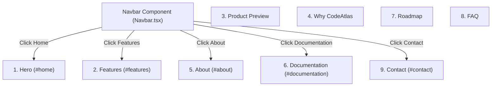

# Walkthrough - Milestone 3.3.3 Landing Page Information Architecture

The standalone About and Contact pages have been successfully retired, and their contents refactored as modular, high-quality, scrolling sections on the main landing page, creating a single unified SaaS marketing home route.

## Files Deleted
- **Standalone About Route**: `/about` (`apps/web/src/app/(marketing)/about/page.tsx`)
- **Standalone Contact Route**: `/contact` (`apps/web/src/app/(marketing)/contact/page.tsx`)

## Files Created
- **About Landing Section** ([apps/web/src/features/landing/components/About.tsx](file:///Users/gauravgupta/Desktop/CodeAtlas/apps/web/src/features/landing/components/About.tsx)):
  - Declares the `#about` section id.
  - Highlights Our Mission (simplifying codebase context), Why CodeAtlas (6-card grid), and Built With (interactive tech stack grid).
- **Documentation Landing Section** ([apps/web/src/features/landing/components/Documentation.tsx](file:///Users/gauravgupta/Desktop/CodeAtlas/apps/web/src/features/landing/components/Documentation.tsx)):
  - Declares the `#documentation` section id.
  - Features a developer-oriented Quick Start schema, Core Features description, visually aligned Architecture Pipeline flow, System Specifications, and Coming Soon roadmap updates.
- **Contact Landing Section** ([apps/web/src/features/landing/components/Contact.tsx](file:///Users/gauravgupta/Desktop/CodeAtlas/apps/web/src/features/landing/components/Contact.tsx)):
  - Declares the `#contact` section id.
  - Renders left-hand contact details (Email, Phone, Location) and right-hand contact form query fields linked directly to our backend endpoint at `POST /api/v1/contact`.

## Files Modified
- **Landing Page Entry** ([apps/web/src/app/(marketing)/page.tsx](file:///Users/gauravgupta/Desktop/CodeAtlas/apps/web/src/app/(marketing)/page.tsx)):
  - Mounted `About`, `Documentation`, and `Contact` components on the homepage sequence.
- **Navbar Layout Component** ([apps/web/src/components/layout/Navbar.tsx](file:///Users/gauravgupta/Desktop/CodeAtlas/apps/web/src/components/layout/Navbar.tsx)):
  - Reset navigation targets to smooth-scroll directly to homepage anchors (`/#home`, `/#features`, `/#about`, `/#documentation`, `/#contact`).

---

## Single Page Marketing Architecture

---

## Verification & Testing Instructions

1. **Verify Smooth Scrolling**:
   - Access `http://localhost:3000/`.
   - Click the navigation headers: **Features**, **About**, **Documentation**, **Contact**.
   - Verify that the window smoothly transitions directly to the respective homepage section.

2. **Verify Integrated Contact Submissions**:
   - Scroll to the bottom Contact section.
   - Enter contact details and submit.
   - Verify that alerts/notifications update successfully and inputs reset as before.
