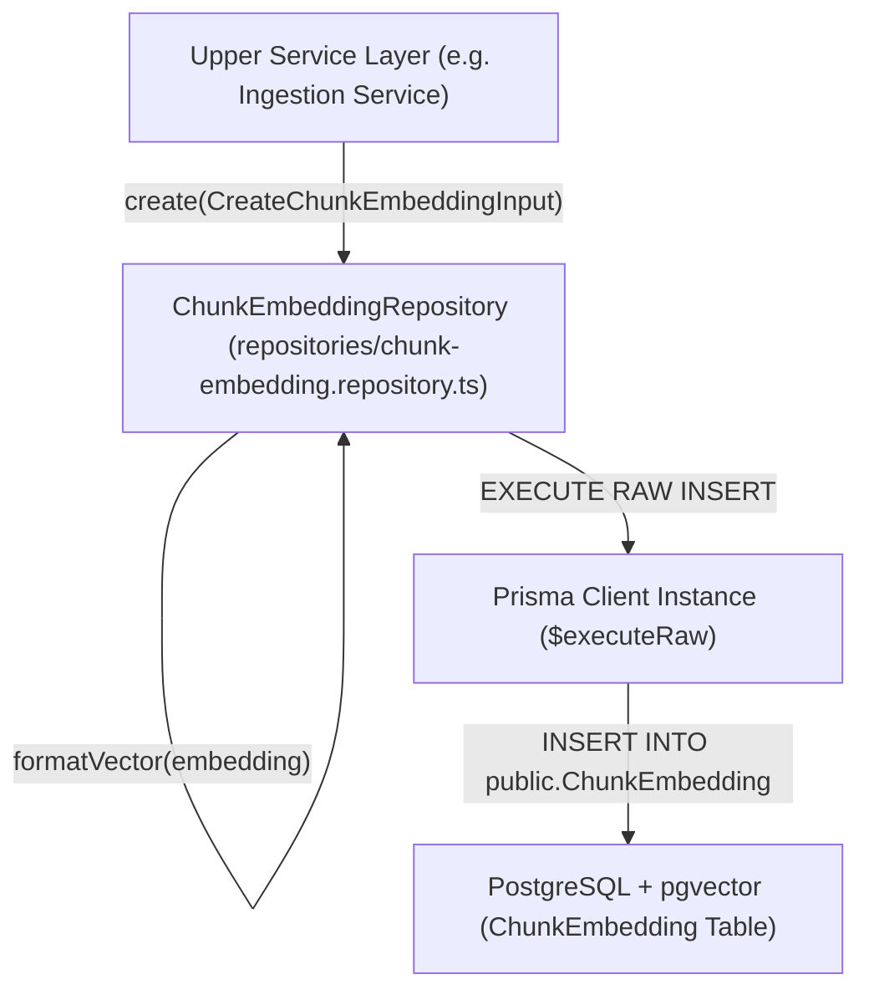

# Walkthrough - Milestone 3.2.1 Chunk Embedding Repository

The new database repository responsible for managing vector database writes for CodeAtlas is now fully implemented. It encapsulates raw parameterized PostgreSQL queries safely, formats inputs privately, and exports structured methods.

## Files Created
- **Chunk Embedding Repository** ([apps/api/src/repositories/chunk-embedding.repository.ts](file:///Users/gauravgupta/Desktop/CodeAtlas/apps/api/src/repositories/chunk-embedding.repository.ts)):
  - Defines the data insertion shape interface `CreateChunkEmbeddingInput`.
  - Implements the `ChunkEmbeddingRepository` class with `create(input)` and a placeholder `deleteByRepository(repositoryId)` method.
  - Converts high-dimensional vector numeric arrays (`number[]`) into PostgreSQL pgvector formatting (`'[0.1, -0.2, ...]'`) inside the private helper method `formatVector()`.
  - Performs parameterized SQL inserting using Prisma `$executeRaw` to prevent SQL injection vulnerabilities.
  - Catches database errors and maps them to structured `AppError` exceptions with Winston logging.

---

## Code Structure Layout



---

## Verification & Testing Instructions

1. **Confirm Database Tables**:
   Verify the table structure matches our repository properties using the CLI:
   ```bash
   docker exec -it codeatlas-postgres psql -U postgres -d codeatlas -c "\d \"ChunkEmbedding\""
   ```

2. **Run Tests / Build**:
   ```bash
   npm run build
   ```
