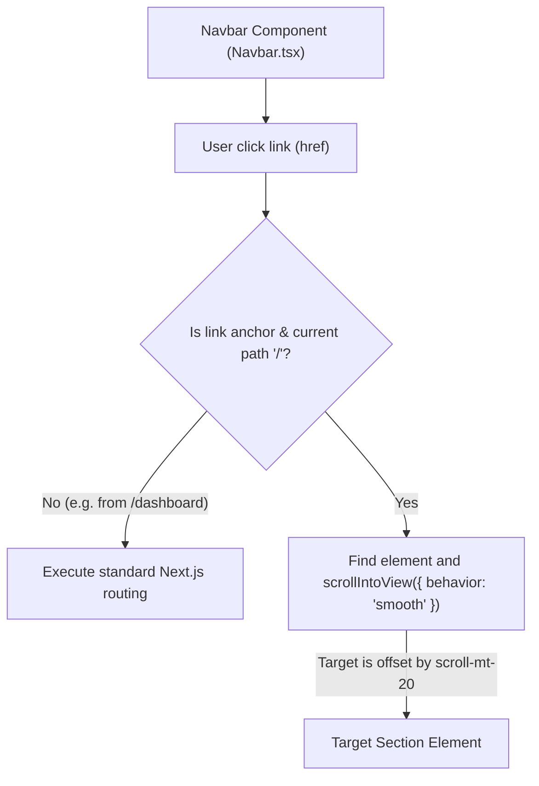

# Walkthrough - Milestone 3.3.5 Navigation Offset & Document Anchor Fixes

All marketing sections on the homepage have been fully aligned, offset spacing has been added to sections to handle sticky header heights, and smooth scroll intercept handlers have been successfully configured on both desktop and mobile layouts.

## Files Modified
- **Section Layout Component** ([apps/web/src/components/common/Section.tsx](file:///Users/gauravgupta/Desktop/CodeAtlas/apps/web/src/components/common/Section.tsx)):
  - Added global `scroll-mt-20` (scroll margin top offset) to prevent any section header from being cropped or hidden behind the sticky navbar.
- **Navbar Layout Component** ([apps/web/src/components/layout/Navbar.tsx](file:///Users/gauravgupta/Desktop/CodeAtlas/apps/web/src/components/layout/Navbar.tsx)):
  - Implemented a `handleNavClick` intercept handler for anchor jump tags starting with `/#` or `#`.
  - When matching current pathname route contexts, navigation events trigger native `element.scrollIntoView({ behavior: 'smooth' })` commands instead of hard browser page jumps.
- **FAQ Page Component** ([apps/web/src/features/landing/components/FAQ.tsx](file:///Users/gauravgupta/Desktop/CodeAtlas/apps/web/src/features/landing/components/FAQ.tsx)):
  - Configured Section element with `id="pricing"` to receive pricing target scrolls.

---

## Smooth Scroll Layout Logic

---

## Verification & Testing Instructions

1. **Verify Smooth Scroll Triggers**:
   - Access `http://localhost:3000/`.
   - Scroll to the bottom of the page, then click **Home**, **Features**, **About**, **Documentation**, **Pricing**, **Contact** in the navbar.
   - Confirm that the viewport transitions smoothly to the designated section.
   - Verify that the title of the section is fully visible and offset correctly below the sticky header.
