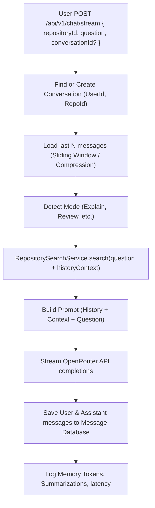

# Walkthrough - Milestone 4.8 Repository Conversation Memory

The CodeAtlas workspace now supports multi-turn conversations, persistence of chat sessions, and intelligent sliding window/summarization context compression.

## Files Created / Modified
- **Prisma Schema** ([apps/api/prisma/schema.prisma](file:///Users/gauravgupta/Desktop/CodeAtlas/apps/api/prisma/schema.prisma)):
  - Extended model layouts with `Conversation` and `Message` tables mapped to `User` and `Repository`.
- **Repository Conversation Service** ([apps/api/src/services/repository-conversation.service.ts](file:///Users/gauravgupta/Desktop/CodeAtlas/apps/api/src/services/repository-conversation.service.ts)):
  - Implemented `createConversation`, `listConversations`, `renameConversation`, `deleteConversation`, and `addMessage` persistence routines.
  - Implemented `getHistoryContext` using a sliding window strategy (last 6 messages) and automated summarization of older dialogue pairs using OpenRouter.
- **Conversation Controller** ([apps/api/src/controllers/conversation.controller.ts](file:///Users/gauravgupta/Desktop/CodeAtlas/apps/api/src/controllers/conversation.controller.ts)):
  - Added endpoints list, rename, delete, and messages query methods.
- **Conversation Router** ([apps/api/src/routes/conversation.routes.ts](file:///Users/gauravgupta/Desktop/CodeAtlas/apps/api/src/routes/conversation.routes.ts)):
  - Mounted `/api/v1/conversations` paths.
- **REST Index** ([apps/api/src/index.ts](file:///Users/gauravgupta/Desktop/CodeAtlas/apps/api/src/index.ts)):
  - Registered conversation routes globally.
- **Repository Chat Service** ([apps/api/src/services/repository-chat.service.ts](file:///Users/gauravgupta/Desktop/CodeAtlas/apps/api/src/services/repository-chat.service.ts)):
  - Adjusted RAG executions to load context history and append user/assistant messages to SQL database.
- **Chat Controller** ([apps/api/src/controllers/chat.controller.ts](file:///Users/gauravgupta/Desktop/CodeAtlas/apps/api/src/controllers/chat.controller.ts)):
  - Enabled dynamic conversation creations and initial `conversationId` emissions over SSE stream.
- **API Client Utility** ([apps/web/src/lib/api-client.ts](file:///Users/gauravgupta/Desktop/CodeAtlas/apps/web/src/lib/api-client.ts)):
  - Expose PATCH helper mapping endpoint requests.
- **Chat Workspace Page** ([apps/web/src/app/(dashboard)/dashboard/repository/[id]/chat/page.tsx](file:///Users/gauravgupta/Desktop/CodeAtlas/apps/web/src/app/(dashboard)/dashboard/repository/[id]/chat/page.tsx)):
  - Added History Sidebar Panel inside the AI column listing recent chats.
  - Added New Chat, Continue Chat, Rename Conversation, Delete Conversation, and Clear Chat state features.

---

## Multi-Turn Conversational Memory Pipeline

---

## Verification & Testing Instructions

1. **Verify Chat Persistence Sidebar**:
   - Open `/dashboard/repository/REPO_ID/chat`.
   - Click the "History" (clock icon) button in the assistant header.
   - Verify that your recent conversations are listed, showing titles and last updated dates.
2. **Verify Multi-Turn Context**:
   - Start a new conversation and ask: `"What database configuration is mapped in this project?"`.
   - Once answered, ask a follow-up: `"Where is it declared?"` (omitting database context).
   - Confirm that the AI uses conversation memory history to correctly locate `schema.prisma` or `database.ts`.
3. **Verify Renames & Deletes**:
   - Hover over a conversation item in the history list.
   - Click the pencil icon to rename, input a new title, and click "Save".
   - Click the trash icon to delete a conversation thread and verify it gets removed.
