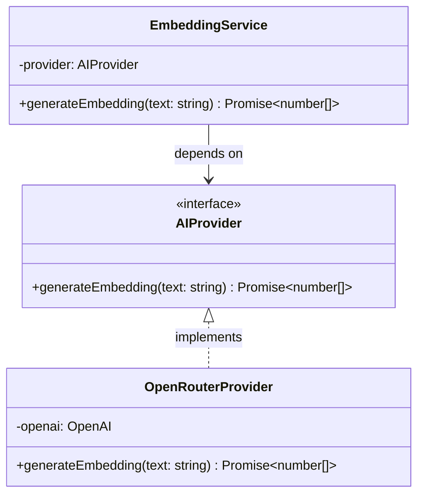

# Walkthrough - Milestone 2.6.3 AI Provider Pattern Refactoring

The AI embedding module has been successfully refactored using the **Provider Pattern**. This isolates API client initializations and response parsing formats from core business validation and logging steps, allowing CodeAtlas to seamlessly support future providers such as Gemini or Ollama.

## Files Created
- **AI Provider Interface** ([apps/api/src/services/ai/providers/AIProvider.ts](file:///Users/gauravgupta/Desktop/CodeAtlas/apps/api/src/services/ai/providers/AIProvider.ts)):
  - Defines the interface contract requiring `generateEmbedding(text: string): Promise<number[]>`.
- **OpenRouter Provider** ([apps/api/src/services/ai/providers/OpenRouterProvider.ts](file:///Users/gauravgupta/Desktop/CodeAtlas/apps/api/src/services/ai/providers/OpenRouterProvider.ts)):
  - Implements the `AIProvider` contract.
  - Houses OpenRouter-specific configurations (setting base URL to `https://openrouter.ai/api/v1` and using model definitions).
  - Handles OpenAI Node SDK client initialization and response payload parsing.

## Files Modified
- **Embedding Service** ([apps/api/src/services/ai/embedding.service.ts](file:///Users/gauravgupta/Desktop/CodeAtlas/apps/api/src/services/ai/embedding.service.ts)):
  - Refactored to depend strictly on the `AIProvider` abstraction.
  - Constructor accepts an optional custom provider, defaulting to `OpenRouterProvider`.
  - Preserves input trimming, empty-check validations, Winston logging calls, and `AppError` exception mappings.
  - Retains the exact public signature `generateEmbedding(text: string): Promise<number[]>` to avoid breaking change issues.

---

## AI Module Provider Architecture



---

## Verification & Testing Instructions

1. **Boot dev backend**:
   ```bash
   npm run dev -w apps/api
   ```

2. **Trigger request to temporary dev route**:
   Verify that embedding generation functions as expected after refactoring:
   ```bash
   curl -i -X POST -H "Content-Type: application/json" -d '{"text": "Hello Refactored Provider Pattern!"}' http://localhost:4000/api/v1/dev/embedding
   ```
   *Expected Response:*
   `HTTP/1.1 200 OK`
   ```json
   {
     "success": true,
     "message": "TEMPORARY DEVELOPMENT ENDPOINT: Embedding generated successfully.",
     "dimensions": 1536,
     "preview": [...]
   }
   ```
