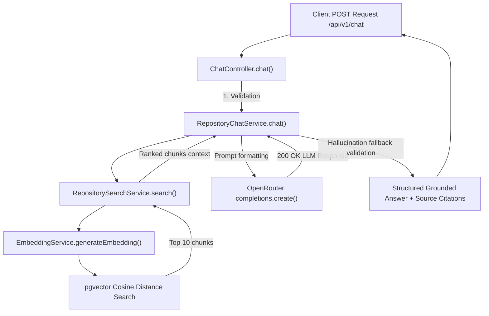

# Walkthrough - Milestone 4.2 AI Repository Chat (RAG)

Retrieval-Augmented Generation (RAG) is now fully integrated inside the backend codebase under route `POST /api/v1/chat`.

## Files Created / Modified
- **Repository Chat Service** ([apps/api/src/services/repository-chat.service.ts](file:///Users/gauravgupta/Desktop/CodeAtlas/apps/api/src/services/repository-chat.service.ts)):
  - Implements the complete chat logical pipeline.
  - Generates query vectors, fetches top-ranked matching chunks (via `RepositorySearchService`), builds grounded system prompts, queries OpenRouter's completion APIs, and maps sources citation.
  - Implemented custom fallback mapping normalization to protect against context hallucinations.
- **Chat Controller** ([apps/api/src/controllers/chat.controller.ts](file:///Users/gauravgupta/Desktop/CodeAtlas/apps/api/src/controllers/chat.controller.ts)):
  - Performs schema validation rejecting missing repositories, empty question prompts, or questions longer than 3000 characters.
- **Chat Routes** ([apps/api/src/routes/chat.routes.ts](file:///Users/gauravgupta/Desktop/CodeAtlas/apps/api/src/routes/chat.routes.ts)):
  - Exposes `POST /` mapped to `ChatController.chat` secured behind standard Clerk authentication layers.
- **App Main Bootstrap** ([apps/api/src/index.ts](file:///Users/gauravgupta/Desktop/CodeAtlas/apps/api/src/index.ts)):
  - Registered `/api/v1/chat` route endpoints.

---

## AI Chat (RAG) Architecture



---

## Verification & Testing Instructions

1. **Verify Endpoint Response structure**:
   - Issue a chat query request against the Express endpoint:
     ```bash
     curl -X POST http://localhost:5001/api/v1/chat \
       -H "Content-Type: application/json" \
       -d '{"repositoryId": "REPO_UUID", "question": "How is authentication implemented?"}'
     ```
   - Verify that the response includes grounded text matching citation lists:
     ```json
     {
       "success": true,
       "answer": "Authentication is implemented using Clerk inside index.ts...",
       "sources": [
         {
           "filePath": "apps/api/src/index.ts",
           "startLine": 1,
           "endLine": 35,
           "similarity": 0.895
         }
       ]
     }
     ```
