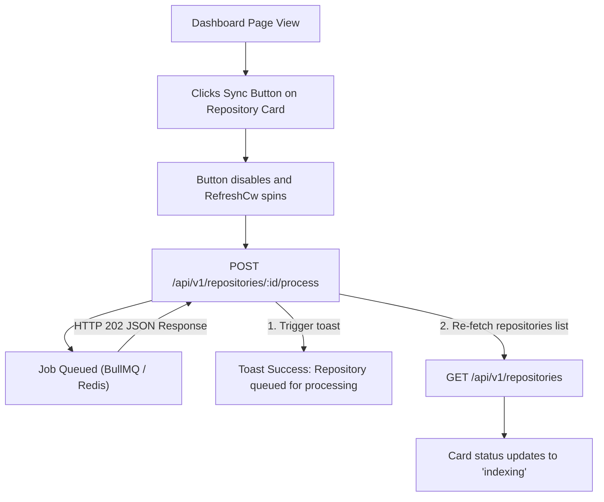

# Walkthrough - Milestone 3.3.5 Dashboard Sync Button Connection

The dashboard's **Sync** button is now connected directly to the existing backend queue processing route (`POST /api/v1/repositories/:id/process`).

## Files Modified
- **Dashboard Page Component** ([apps/web/src/app/(dashboard)/dashboard/page.tsx](file:///Users/gauravgupta/Desktop/CodeAtlas/apps/web/src/app/(dashboard)/dashboard/page.tsx)):
  - Updated `handleSyncRepo` to make an asynchronous `api.post` call to `/v1/repositories/${id}/process`.
  - Disables action items and displays spinner classes to signal background analysis queue operations.
  - Automatically fetches updated repository list from `/v1/repositories` upon successful queuing.
  - Triggers toast alerts informing the user of the queuing status or failure codes.

---

## Sync Integration Flow

---

## Verification & Testing Instructions

1. **Verify Sync Trigger Pipeline**:
   - Access the dashboard page at `/dashboard`.
   - Click the **Sync** button next to any imported repository.
   - Verify that the card's status badge updates to `Indexing` and the sync button spins.
   - Check the backend console to confirm the logs output:
     * `Job queued`
     * `Worker started`
     * `Clone started`
     * `Analysis started`
     * `Processing completed`
