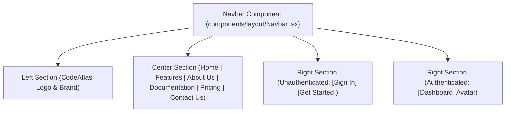

# Walkthrough - Milestone 3.3.1 Professional SaaS Navigation Experience

The CodeAtlas navigation has been redesigned to reflect a premium SaaS platform structure (similar to Linear, Supabase, and Vercel). The core marketing navigation remains present at all times, while the **Dashboard** link transitions to an outstanding outlined action button on the right side of the navbar.

## Files Modified
- **Navbar Layout Component** ([apps/web/src/components/layout/Navbar.tsx](file:///Users/gauravgupta/Desktop/CodeAtlas/apps/web/src/components/layout/Navbar.tsx)):
  - Restored marketing links in the center section: **Home**, **Features**, **About Us**, **Documentation**, **Pricing (Soon)**, and **Contact Us**.
  - Relocated the **Dashboard** link for authenticated sessions from the center lists to the right action button group.
  - Formatted the **Dashboard** link as a secondary action button featuring a subtle border, hover background transitions, rounded-xl borders, and a mini Arrow icon.
  - Maintained full responsiveness, ensuring that mobile drawers list marketing links and present the Dashboard button as an item in the bottom authentication action cards.

---

## Redesigned Navigation Layout

---

## Verification & Testing Instructions

1. **Verify Unauthenticated Menu**:
   - Navigate to `http://localhost:3000/`.
   - The center navigation lists:
     * **Home**
     * **Features**
     * **About Us**
     * **Documentation**
     * **Pricing (Soon)**
     * **Contact Us**
   - The right action group presents **Sign In** and **Get Started** options.

2. **Verify Authenticated Menu**:
   - Sign in using Clerk.
   - The center navigation remains unchanged, retaining the entire marketing links layout.
   - The right action group replaces Sign In/Get Started with:
     * A premium styled **Dashboard** button (featuring rounded-xl borders and a hover translation animation).
     * The Clerk **User Profile button**.
   - Click the **Dashboard** button to navigate to `/dashboard`.
