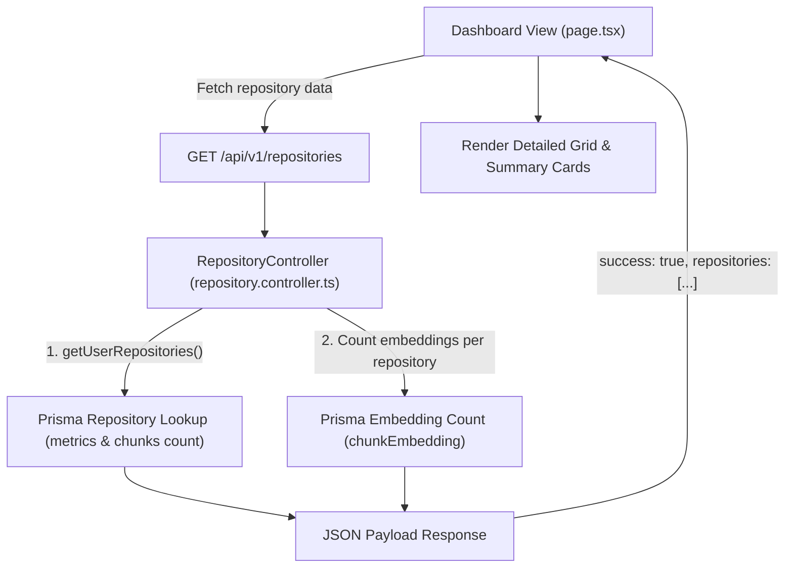

# Walkthrough - Milestone 3.3.5 Dashboard Backend Data Integration

The dashboard page has been fully configured to fetch, aggregate, and display actual repository metrics and indexing progress parameters.

## Backend Changes
- **Repository Repository** ([apps/api/src/repositories/repository.repository.ts](file:///Users/gauravgupta/Desktop/CodeAtlas/apps/api/src/repositories/repository.repository.ts)):
  - Updated the `findByUser` query to include `metrics` and `_count` (for chunks) relation selections.
- **Repository Service** ([apps/api/src/services/repository.service.ts](file:///Users/gauravgupta/Desktop/CodeAtlas/apps/api/src/services/repository.service.ts)):
  - Updated `getUserRepositories` signatures to return relation structures.
- **Repository Controller** ([apps/api/src/controllers/repository.controller.ts](file:///Users/gauravgupta/Desktop/CodeAtlas/apps/api/src/controllers/repository.controller.ts)):
  - Updated `getUserRepositories` handler to execute parallel embedding count calls (`prisma.chunkEmbedding.count`) for each repository, returning complete payloads back to the front-end dashboard.

## Frontend Changes
- **Dashboard Types** ([apps/web/src/features/dashboard/types.ts](file:///Users/gauravgupta/Desktop/CodeAtlas/apps/web/src/features/dashboard/types.ts)):
  - Extended the `Repository` and `CodeMetric` definitions to hold description, language, stars, forks, watchers, default branch, chunks count, embeddings count, and dependency counts.
- **Dashboard Page Component** ([apps/web/src/app/(dashboard)/dashboard/page.tsx](file:///Users/gauravgupta/Desktop/CodeAtlas/apps/web/src/app/(dashboard)/dashboard/page.tsx)):
  - Configured five responsive summary cards displaying total repositories, total files, total lines of code, average complexity score, and AI ready repositories.
  - Dynamically renders status badges representing imported, queued, cloning, analyzing, indexing, completed, and failed status flows.
  - Displays indexing metadata boxes detailing chunk sizes, embedding quantities, complexity ranks, dependency metrics, and language percentage bars.

---

## Live Dashboard Mapping Loop

---

## Verification & Testing Instructions

1. **Verify Live Data Synchronization**:
   - Access the dashboard page at `/dashboard`.
   - Confirm that the aggregated totals on the summary cards represent actual repository files and lines counts.
   - Click the **Sync** button next to any imported repository.
   - Observe that the status badge updates to `Indexing...` and refresh results automatically reflect completed processing counts (chunks, files, languages, and complexity metrics).
