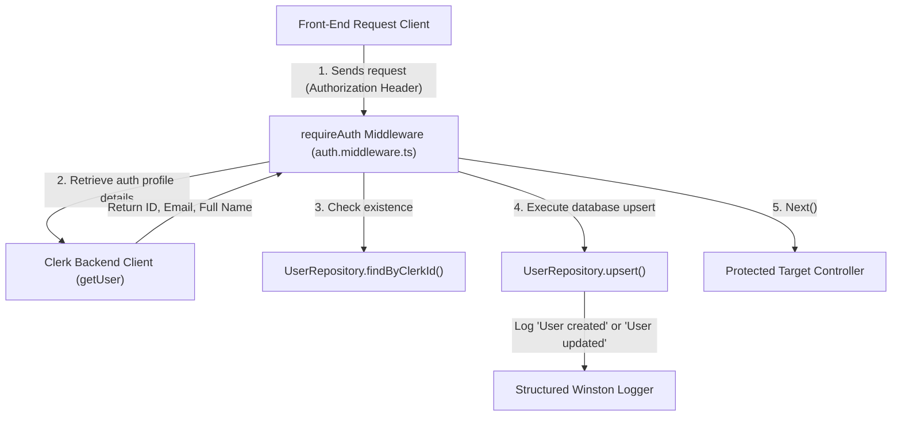

# Walkthrough - Milestone 3.3.4 User Synchronization with Clerk

Automatic synchronization between Clerk authentication users and the application's PostgreSQL `User` table has been deployed to execute before protected routing handlers run.

## Files Modified
- **Authentication Middleware** ([apps/api/src/middleware/auth.middleware.ts](file:///Users/gauravgupta/Desktop/CodeAtlas/apps/api/src/middleware/auth.middleware.ts)):
  - Augmented the `requireAuth` middleware to fetch the user profile from `clerkClient` and upsert details using `UserRepository.upsert()`.
  - Configured structured winston logging triggers:
    * `"User synchronized: User created in database (ID: ...)"`
    * `"User synchronized: User updated in database (ID: ...)"`
    * `"Clerk user DB synchronization failure: ..."` in case of connection exceptions.

---

## User Synchronization Loop

---

## Verification & Testing Instructions

1. **Verify Database Upsert Activity**:
   - Access `http://localhost:3000/dashboard` using a signed-in account.
   - Run a request that hits a protected backend route.
   - Run `docker exec -it codeatlas-postgres psql -U postgres -d codeatlas -c 'SELECT * FROM "User";'`
   - Confirm that the logged-in user record has been correctly inserted or updated.
   - Verify that there are no foreign key constraint violations during subsequent repository import transactions.
