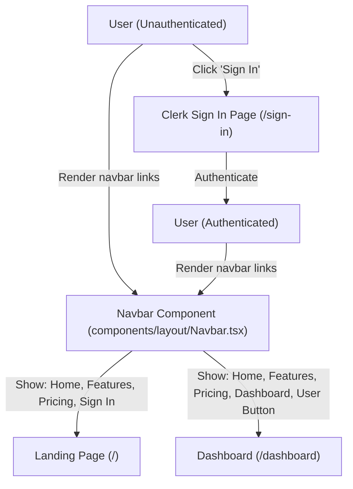

# Walkthrough - Milestone 3.3.0 Dashboard Navigation & Clerk Authentication UX

An authenticated navigation path has been integrated into CodeAtlas. When users authenticate, the global Navbar dynamically updates to present a **Dashboard** link targeting the authenticated workspace, with active route states cleanly highlighted.

## Files Modified
- **Navbar Layout Component** ([apps/web/src/components/layout/Navbar.tsx](file:///Users/gauravgupta/Desktop/CodeAtlas/apps/web/src/components/layout/Navbar.tsx)):
  - Imported Clerk's client-side authentication hook `useAuth`.
  - Imported Next.js `usePathname` from `next/navigation`.
  - Added a conditional `Dashboard` navigation entry mapping to `/dashboard` which renders exclusively for authenticated sessions.
  - Linked root landing targets (`Home`, `Features`, `Pricing`) back to the homepage hashes (`/`, `/#features`), ensuring that anchor jumps work even when called from pages like `/dashboard`.
  - Implemented visually distinct CSS states to highlight the active tab matching Next.js's current pathname context.

---

## Authenticated User Navigation Layout

---

## Verification & Testing Instructions

1. **Verify Unauthenticated Navigation Layout**:
   - Access `http://localhost:3000/`.
   - The navigation links list displays:
     * **Home**
     * **Features**
     * **Pricing (Soon)**
     * **Sign In** (Right Action button)
     * **Get Started** (Right Action button)
   - Ensure the **Dashboard** link is completely hidden.

2. **Verify Dashboard Route Protections**:
   - Manually clear session cookies or open an incognito browser window.
   - Enter: `http://localhost:3000/dashboard`.
   - Ensure you are immediately redirected to Clerk's sign-in page.

3. **Verify Authenticated UX Navigation Path**:
   - Sign in using Clerk.
   - You will be redirected back to the landing page.
   - Verify the global Navbar now displays:
     * **Home**
     * **Features**
     * **Pricing (Soon)**
     * **Dashboard**
     * **User Button** (Clerk profile avatar on the right)
   - Click the **Dashboard** link and verify Next.js takes you to `/dashboard` with the active route text correctly styled.
