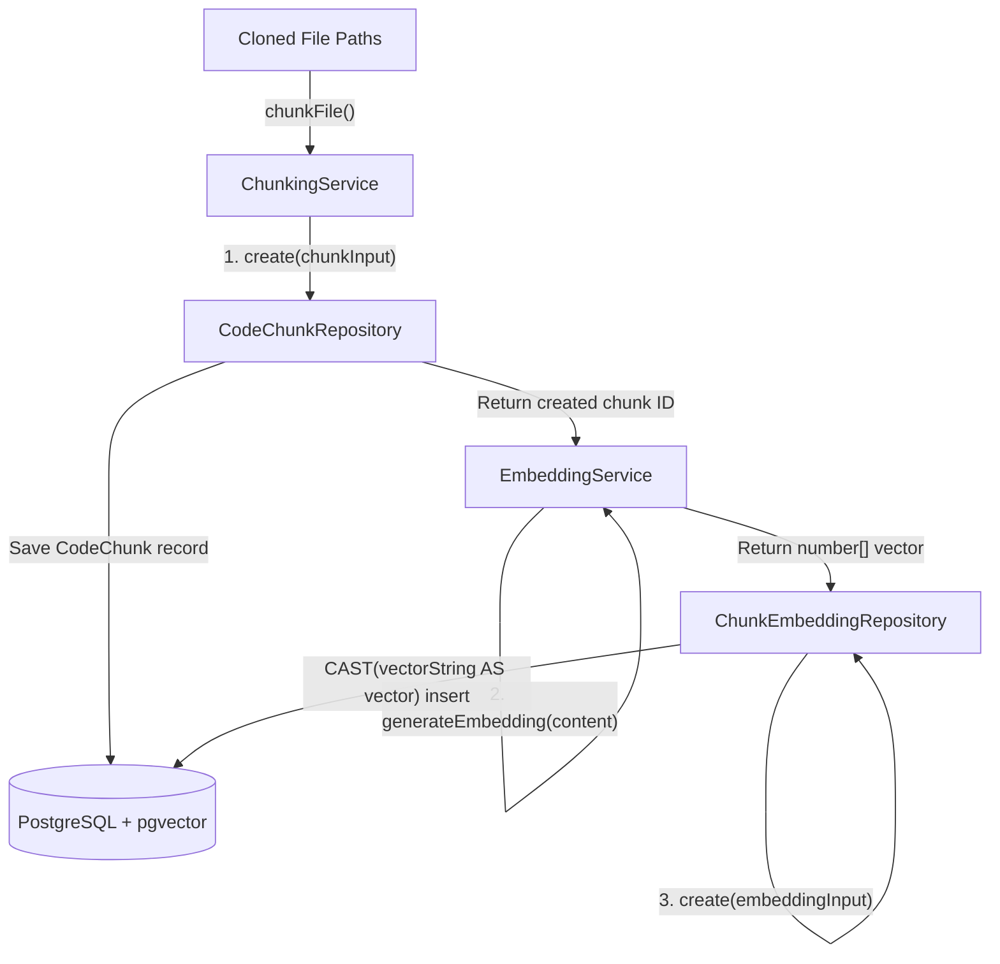

# Walkthrough - Milestone 3.2.3 Repository Indexing Embedding Integration

The codebase indexing pipeline has been successfully upgraded to perform sliding window code chunk partition generation, invoke the pluggable OpenRouter `EmbeddingService`, and persist high-dimensional vector embeddings in PostgreSQL.

## Files Modified
- **Repository Processing Service** ([apps/api/src/services/repository-processing.service.ts](file:///Users/gauravgupta/Desktop/CodeAtlas/apps/api/src/services/repository-processing.service.ts)):
  - Injected `EmbeddingService` (via the existing `createAIProvider` factory) and `ChunkEmbeddingRepository` inside the constructor.
  - Replaced the bulk `createMany` flow with a sequential per-chunk pipeline:
    1. Persist the chunk using `CodeChunkRepository.create()`.
    2. Invoke `EmbeddingService.generateEmbedding(content)`.
    3. Persist the high-dimensional vector using `ChunkEmbeddingRepository.create()` with provider/model/dimensions metadata.
  - Kept all existing validations, Winston logs, and error handler blocks intact.

---

## Code Ingestion Flow Layout



---

## Verification & Testing Instructions

1. **Start workspaces**:
   ```bash
   npm run dev
   ```

2. **Trigger ingestion**:
   * Navigate to the dashboard at `http://localhost:3000/dev/sync-user`.
   * Click **Process Repository** for any repository.
   * As the background worker triggers:
     - Each code chunk is persisted.
     - Vector embedding endpoints are queried.
     - High-dimensional vectors are stored in the database.
   * Verify using PostgreSQL that table rows exist with non-empty embedding properties:
     ```bash
     docker exec -it codeatlas-postgres psql -U postgres -d codeatlas -c "SELECT count(*) FROM \"ChunkEmbedding\";"
     ```
