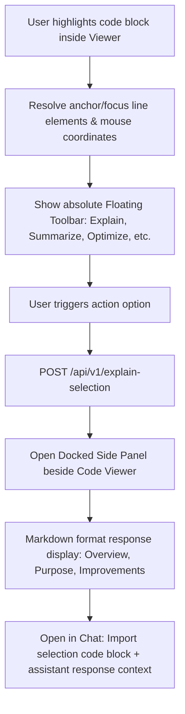

# Walkthrough - Sprint 4.9 Explain Selected Code

The repository viewer now enables interactive code selection, displaying a context-aware floating toolbar with options to Explain, Summarize, Find Bugs, Optimize, or audit Security. Detailed reviews open in a dedicated side panel next to the Code Viewer, leaving main chat history unaffected.

## Files Created / Modified
- **Explain Controller** ([explain.controller.ts](file:///Users/gauravgupta/Desktop/CodeAtlas/apps/api/src/controllers/explain.controller.ts)):
  - Created prompt builders to parse target files, starting/ending line boundaries, and highlighted code snippets.
  - Formatted generated report templates containing sections: Overview, Purpose, How It Works, Dependencies, Possible Improvements, Potential Bugs, and Best Practices.
- **Explain Router** ([explain.routes.ts](file:///Users/gauravgupta/Desktop/CodeAtlas/apps/api/src/routes/explain.routes.ts)):
  - Mounted explain-selection paths securely behind Clerk authenticator filters.
- **REST Bootstrap Server** ([index.ts](file:///Users/gauravgupta/Desktop/CodeAtlas/apps/api/src/index.ts)):
  - Registered `POST /api/v1/explain-selection` endpoints globally.
- **Chat Workspace Page** ([page.tsx](file:///Users/gauravgupta/Desktop/CodeAtlas/apps/web/src/app/(dashboard)/dashboard/repository/[id]/chat/page.tsx)):
  - Added mouse selection handlers over the code lines workspace view to retrieve absolute selection ranges.
  - Developed the Floating Selection Toolbar popping up at mouse coordinates.
  - Implemented the Selection Review side drawer overlaying next to the file viewer, with Copy actions, Open in Chat imports, and custom Follow-up inputs.

---

## Interactive Code Selection Flow

---

## Verification & Testing Instructions

1. **Verify Text Selection listener**:
   - Go to `/dashboard/repository/REPO_ID/chat`.
   - Highlight any block of code inside the center Code Viewer panel.
   - Verify that the floating options toolbar immediately appears above the highlighted text.
2. **Verify Action review & Custom Prompt layouts**:
   - Click `"✨ Explain"` on the floating toolbar.
   - Confirm that the docked "Selection Review" panel slides open on the right of the Code Viewer.
   - Verify that the analysis sections (Overview, Purpose, How It Works, Dependencies, Improvements, Bugs, Best Practices) are rendered.
3. **Verify Side Panel features**:
   - Verify follow-up questions inside the Side Panel input box.
   - Click "Open in Chat" and verify that this specific code block and explanation are successfully imported into your primary Grounded Chat feed on the right column.
