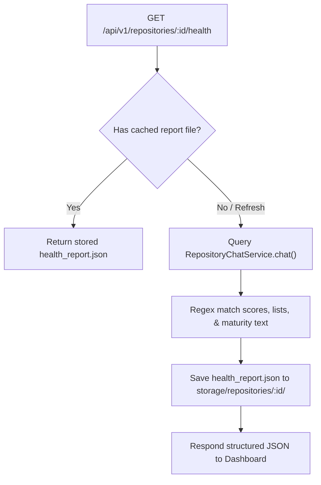

# Walkthrough - Sprint 5.0 AI Repository Health Dashboard

Every connected repository codebase now has an AI-generated health scorecard. A dedicated "Repository Health" view renders category assessments, progress indicators, maturity levels, strengths/weaknesses grids, and recommendations.

## Files Created / Modified
- **Repository Health Service** ([repository-health.service.ts](file:///Users/gauravgupta/Desktop/CodeAtlas/apps/api/src/services/repository-health.service.ts)):
  - Built score aggregation services recycling prompt logic definitions inside `RepositoryChatService`.
  - Configured JSON caching buffers (`health_report.json`) to persist scores for instant returns.
  - Coded robust regex mapping functions converting markdown lists to structured scorecard properties.
- **Health Controller** ([health.controller.ts](file:///Users/gauravgupta/Desktop/CodeAtlas/apps/api/src/controllers/health.controller.ts)):
  - Handled database ownership verification checks and refresh requests.
- **Repository Router** ([repository.routes.ts](file:///Users/gauravgupta/Desktop/CodeAtlas/apps/api/src/routes/repository.routes.ts)):
  - Registered `GET /api/v1/repositories/:id/health`.
- **Chat Workspace Page** ([page.tsx](file:///Users/gauravgupta/Desktop/CodeAtlas/apps/web/src/app/(dashboard)/dashboard/repository/[id]/chat/page.tsx)):
  - Designed the Repository Health layout panels, scorecard progress bars, and estimated maturity badges.
  - Linked export buttons for Markdown format file downloads and print-friendly PDF stylesheet hooks.

---

## AI Health Report Pipeline

---

## Verification & Testing Instructions

1. **Verify Health Dashboard Layout**:
   - Open `/dashboard/repository/REPO_ID/chat`.
   - Click the **📊 Repository Health** tab at the top of the Center Panel.
   - Verify category assessments for Architecture, Maintainability, Readability, Security, Performance, Documentation, Testing, and Scalability.
2. **Verify Strengths, Weaknesses & Recommendations**:
   - Confirm bullet lists for Core Strengths and Code Weaknesses display correctly.
   - Verify the Top 5 Engineering Recommendations, Quick Wins, and Long-Term Improvements lists.
3. **Verify Refresh & Exports**:
   - Click **🔄 Refresh** to regenerate the AI review.
   - Click **📝 MD** to download the raw markdown report.
   - Click **📄 PDF** to trigger the browser printing dialog (verify print preview is cleanly styled).
