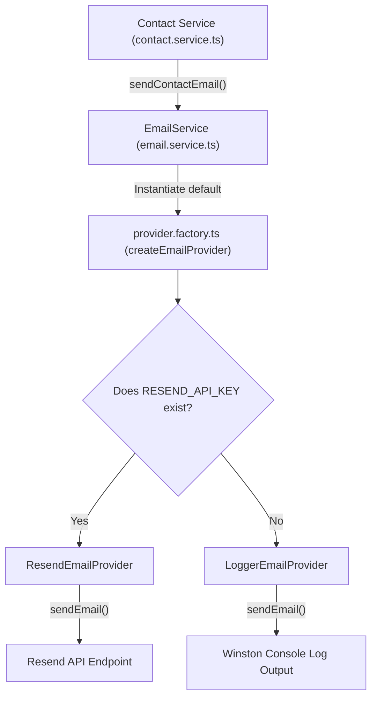

# Walkthrough - Milestone 3.3.6 Integration of Resend Email Provider

The logger-only simulated email dispatching has been upgraded to support the official **Resend Node SDK**. CodeAtlas retains a highly modular provider architecture that easily permits switching between providers.

## Files Created
- **Email Providers** ([apps/api/src/services/email/providers/](file:///Users/gauravgupta/Desktop/CodeAtlas/apps/api/src/services/email/providers/)):
  - [EmailProvider.ts](file:///Users/gauravgupta/Desktop/CodeAtlas/apps/api/src/services/email/providers/EmailProvider.ts): Defines the contract interface for dispatching emails.
  - [LoggerEmailProvider.ts](file:///Users/gauravgupta/Desktop/CodeAtlas/apps/api/src/services/email/providers/LoggerEmailProvider.ts): Handles fallback, simulated logger-only email output logs.
  - [ResendEmailProvider.ts](file:///Users/gauravgupta/Desktop/CodeAtlas/apps/api/src/services/email/providers/ResendEmailProvider.ts): Communicates with Resend API endpoints to dispatch emails.
  - [provider.factory.ts](file:///Users/gauravgupta/Desktop/CodeAtlas/apps/api/src/services/email/providers/provider.factory.ts): Strategy selector deciding between Resend or Logger fallback strategies.

## Files Modified
- **Configuration Parameters** ([apps/api/src/config/index.ts](file:///Users/gauravgupta/Desktop/CodeAtlas/apps/api/src/config/index.ts)):
  - Removed old SMTP options.
  - Mapped `RESEND_API_KEY` to `resendApiKey` and `EMAIL_FROM` to `emailFrom`.
- **Email Service** ([apps/api/src/services/email.service.ts](file:///Users/gauravgupta/Desktop/CodeAtlas/apps/api/src/services/email.service.ts)):
  - Integrated the factory instance by default and refactored sending targets to use `emailFrom`.

---

## Strategy Selection Architecture

---

## Verification & Testing Instructions

1. **Verify Resend Factory fallback**:
   - Start the workspace without a `RESEND_API_KEY` configuration.
   - Submit a query on the contact form.
   - Confirm that the backend log prints the formatted contact email submission.

2. **Verify Resend production delivery**:
   - Provide a valid `RESEND_API_KEY`, `EMAIL_FROM`, and `CONTACT_EMAIL` inside your `.env` configuration.
   - Trigger contact form submission.
   - Verify that Resend dispatches the request successfully and you receive the query details in your `gaurav.init13@gmail.com` inbox.
