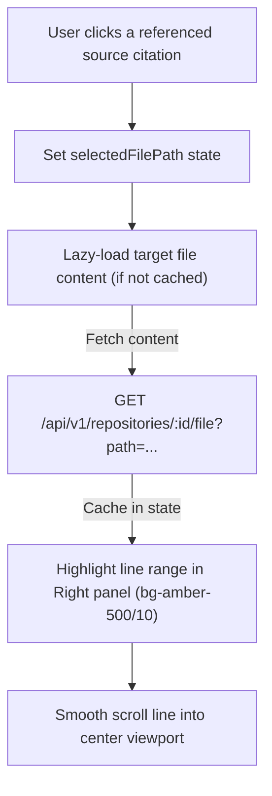

# Walkthrough - Milestone 4.4 Repository Explorer & Clickable Source Viewer

The CodeAtlas platform has been upgraded to a fully integrated repository code explorer and RAG workspace. 

## Files Created / Modified
- **Repository Controller** ([apps/api/src/controllers/repository.controller.ts](file:///Users/gauravgupta/Desktop/CodeAtlas/apps/api/src/controllers/repository.controller.ts)):
  - Added `getRepositoryFiles` returning a sorted files/directories tree (ignoring `.git`, `node_modules`, etc.).
  - Added `getRepositoryFileContent` to lazy-load file content safely (implementing directory traversal prevention checks).
- **Repository Routes** ([apps/api/src/routes/repository.routes.ts](file:///Users/gauravgupta/Desktop/CodeAtlas/apps/api/src/routes/repository.routes.ts)):
  - Mounted `/api/v1/repositories/:id/files` and `/api/v1/repositories/:id/file` endpoints.
- **Custom Markdown** ([apps/web/src/components/Markdown.tsx](file:///Users/gauravgupta/Desktop/CodeAtlas/apps/web/src/components/Markdown.tsx)):
  - Removed unused linter properties/warnings (`_lang`, `inList`).
- **Chat Workspace Page** ([apps/web/src/app/(dashboard)/dashboard/repository/[id]/chat/page.tsx](file:///Users/gauravgupta/Desktop/CodeAtlas/apps/web/src/app/(dashboard)/dashboard/repository/[id]/chat/page.tsx)):
  - Replaced the interface with an IDE-style split panel: Left (File tree explorer), Center (Chat window), Right (File code viewer).
  - Wired source citations to trigger a jump scrolling action: fetches target file content, scrolls to line range, and highlights lines in a yellow visual box.
  - Implemented responsive tab bars for compact mobile screens.
  - Resolved purity checks issues.

---

## Code Viewer Scrolling & Highlighting Flow

---

## Verification & Testing Instructions

1. **Verify File Explorer Tree**:
   - Access `/dashboard/repository/REPO_ID/chat` on desktop.
   - Confirm that the Left panel displays folders and files recursively.
   - Type in the explorer search box to verify lists filter correctly.
2. **Verify Clickable Citations & Highlighting**:
   - Click a citation button (e.g. `index.ts (1-35)`) under an assistant answer.
   - Confirm that the right code pane opens the file, highlights the selected lines, and scrolls smoothly to center the code snippet.
