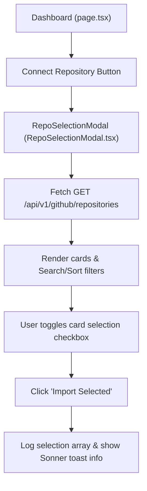

# Walkthrough - Milestone 3.3.2 GitHub Repository Selection Modal

A premium user-friendly repository picker modal component has been designed and integrated with the dashboard page layout. It pulls from `/api/v1/github/repositories` using the client SDK, enables client-side searching, sorting, and multi-selection, and logs selected records upon submission.

## Files Created
- **Repo Selection Modal Component** ([apps/web/src/features/dashboard/components/RepoSelectionModal.tsx](file:///Users/gauravgupta/Desktop/CodeAtlas/apps/web/src/features/dashboard/components/RepoSelectionModal.tsx)):
  - Declares the `RepoSelectionModal` component structure.
  - Controls loading skeletons, search/sort filters, and multi-checkbox select states.
  - Logs selected repositories to the console upon importing.

## Files Modified
- **Dashboard Page Component** ([apps/web/src/app/(dashboard)/dashboard/page.tsx](file:///Users/gauravgupta/Desktop/CodeAtlas/apps/web/src/app/(dashboard)/dashboard/page.tsx)):
  - Wire the modal visibility trigger `isRepoModalOpen` to the "Connect Repository" button handler.

---

## Interactive Select Loop



---

## Verification & Testing Instructions

1. **Start the applications**:
   - Run the development environment:
     ```bash
     npm run dev
     ```

2. **Trigger the Modal Dialog**:
   - Access the dashboard page at `/dashboard`.
   - Click the "Connect Repository" button in the upper right.
   - Verify that the loading skeleton mounts and then displays the fetched repositories list.
   - Type search queries to verify that search filters list matching repositories.
   - Toggle sorting to test sorting by name, stars, and recently updated values.
   - Select multiple cards and click **Import Selected**. Check that the browser developer tools console outputs the selected array and triggers a `Sonner` info toast alert.
