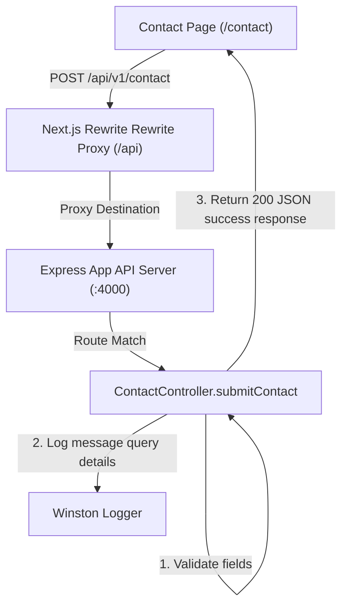

# Walkthrough - Milestone 3.3.2 Dedicated About & Contact Pages

Dedicated marketing pages for `/about` and `/contact` have been successfully created alongside the backend REST API query handler to support structured user queries.

## Backend Changes
- **Contact Controller** ([apps/api/src/controllers/contact.controller.ts](file:///Users/gauravgupta/Desktop/CodeAtlas/apps/api/src/controllers/contact.controller.ts)):
  - Implemented validation for `name`, `email`, `subject`, and `message`.
  - Configured Winston logs to capture form inputs securely and output forwarding records.
- **Contact Router & Mounting** ([apps/api/src/routes/contact.routes.ts](file:///Users/gauravgupta/Desktop/CodeAtlas/apps/api/src/routes/contact.routes.ts) & [apps/api/src/index.ts](file:///Users/gauravgupta/Desktop/CodeAtlas/apps/api/src/index.ts)):
  - Registered `POST /api/v1/contact` to map to the `submitContact` controller.

## Frontend Changes
- **Navbar Layout Component** ([apps/web/src/components/layout/Navbar.tsx](file:///Users/gauravgupta/Desktop/CodeAtlas/apps/web/src/components/layout/Navbar.tsx)):
  - Updated links for About Us and Contact Us to redirect to `/about` and `/contact`.
- **About Page** ([apps/web/src/app/(marketing)/about/page.tsx](file:///Users/gauravgupta/Desktop/CodeAtlas/apps/web/src/app/(marketing)/about/page.tsx)):
  - Design highlighting project hero metrics, core product features (AI Analysis, Semantic Search, Chat), mission, and visual technology stack cards.
- **Contact Page** ([apps/web/src/app/(marketing)/contact/page.tsx](file:///Users/gauravgupta/Desktop/CodeAtlas/apps/web/src/app/(marketing)/contact/page.tsx)):
  - Renders left-hand info panel (Email: gaurav.init13@gmail.com, Phone: +91 9628135776, GitHub, Location) and a professional styled form.
  - Submits queries asynchronously using Next.js proxy client, validating fields and presenting notifications using `sonner` toasts.

---

## Architecture Flow



---

## Verification & Testing Instructions

1. **Verify Navigation Route Jump**:
   - Access `http://localhost:3000/`.
   - Click **About Us** or **Contact Us** and verify you navigate directly to `/about` and `/contact` respectively.

2. **Verify Contact Form API Integration**:
   - Navigate to `http://localhost:3000/contact`.
   - Fill out the contact form details.
   - Click **Send Message**.
   - Verify that a success alert is shown and form fields are reset.
   - Inspect backend logs to confirm that the Winston logger prints the query parameters successfully:
     ```
     [Contact Form Submission]
     Name: ...
     Email: ...
     ```
