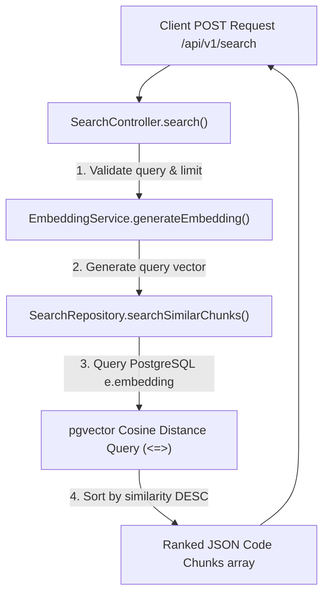

# Walkthrough - Milestone 4.1 Semantic Search (RAG Foundation)

The foundational semantic vector search system has been successfully implemented across the repository, service, and controller layers, exposing a new REST API endpoint `/api/v1/search`.

## Files Created / Modified
- **Search Repository** ([apps/api/src/repositories/search.repository.ts](file:///Users/gauravgupta/Desktop/CodeAtlas/apps/api/src/repositories/search.repository.ts)):
  - Implemented pgvector raw parameterized queries to calculate cosine similarity similarity ranks (`1 - (e.embedding <=> CAST(vector AS vector))`).
- **Repository Search Service** ([apps/api/src/services/repository-search.service.ts](file:///Users/gauravgupta/Desktop/CodeAtlas/apps/api/src/services/repository-search.service.ts)):
  - Integrates `EmbeddingService` to encode the raw string query and filters database records matching `COMPLETED` indexed repositories.
- **Search Controller** ([apps/api/src/controllers/search.controller.ts](file:///Users/gauravgupta/Desktop/CodeAtlas/apps/api/src/controllers/search.controller.ts)):
  - Performs incoming request schema validation (rejecting empty queries, missing repository IDs, and invalid limit numbers).
- **Search Routes** ([apps/api/src/routes/search.routes.ts](file:///Users/gauravgupta/Desktop/CodeAtlas/apps/api/src/routes/search.routes.ts)):
  - Declares the REST route `POST /` mapped to the search handler protected by Clerk session checks.
- **App Main Bootstrap** ([apps/api/src/index.ts](file:///Users/gauravgupta/Desktop/CodeAtlas/apps/api/src/index.ts)):
  - Registered `/api/v1/search` route endpoints.

---

## Semantic Search Pipeline



---

## Verification & Testing Instructions

1. **Verify Endpoint Response structure**:
   - Make a search query request using any authenticated client session:
     ```bash
     curl -X POST http://localhost:5001/api/v1/search \
       -H "Content-Type: application/json" \
       -d '{"repositoryId": "REPO_UUID", "query": "database connection", "limit": 5}'
     ```
   - Check that the returned JSON matches:
     ```json
     {
       "success": true,
       "results": [
         {
           "filePath": "src/database.ts",
           "startLine": 1,
           "endLine": 12,
           "content": "const prisma = ...",
           "similarity": 0.892
         }
       ]
     }
     ```
