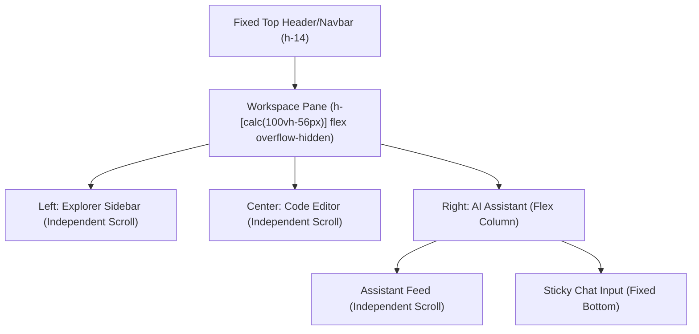

# Walkthrough - Milestone 4.5 Professional AI Workspace UI/UX Redesign

The codebase chat view has been completely upgraded into a professional, dark-mode 3-column AI developer workspace layout.

## Files Created / Modified
- **Custom Markdown** ([apps/web/src/components/Markdown.tsx](file:///Users/gauravgupta/Desktop/CodeAtlas/apps/web/src/components/Markdown.tsx)):
  - Added support for Callout/Alert boxes (Info, Tips, Warnings).
  - Added custom Dividers and structured HTML Table parsers.
- **Chat Workspace Page** ([apps/web/src/app/(dashboard)/dashboard/repository/[id]/chat/page.tsx](file:///Users/gauravgupta/Desktop/CodeAtlas/apps/web/src/app/(dashboard)/dashboard/repository/[id]/chat/page.tsx)):
  - Structured standard viewport-bounded layout `h-[calc(100vh-57px)] overflow-hidden` preventing main page scrolls.
  - Divided elements into: Left (File tree, fixed search), Center (Code editor scrollable viewer), Right (Assistant).
  - Built sticky footer chat inputs and repository metadata panels.
  - Formatted progressive loader cycles.
  - Re-mapped empty states with visual logos andSuggested question cards.
  - Redesigned clickable source citations into cards showing line boundaries and similarity metrics.

---

## 3-Column IDE Layout Scrolling Hierarchy

---

## Verification & Testing Instructions

1. **Verify Independent Scrolling Panels**:
   - Open `/dashboard/repository/REPO_ID/chat`.
   - Scroll inside the File Tree explorer, the Code Viewer, and the Chat Feed respectively.
   - Confirm that only the focused panel scrolls, while the main page container and the chat input remain sticky and visible.
2. **Verify Citations Cards**:
   - Ask a question to generate citations (e.g. `Explain routing`).
   - Observe the source citations render as detailed cards displaying line ranges and similarity metrics.
   - Click a citation card to verify it loads the referenced code and highlights it.
3. **Verify Progressive Thinking Loader**:
   - Send any query in the input and observe the progress bar transition between:
     - `🤖 Thinking...`
     - `🔍 Searching repository chunks...`
     - `📂 Retrieving relevant code context...`
     - `✍️ Generating answer...`
